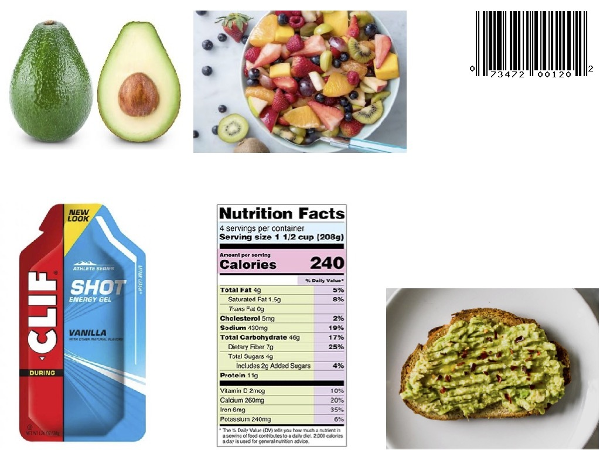

# Passio Nutrition-AI Flutter SDK

## Overview

Welcome to Passio Nutrition-AI Flutter SDK!

When integrated into your app the SDK provides you with food recognition and nutrition assistant technology. The SDK is designed to take a stream of images and output foods recognized in those images along with nutrition data related to the recognized foods.


As the developer, you have complete control of when to turn on/off the SDK and to configure the outputs which includes:
- food names (e.g. banana, hamburger, fruit salad, quest chocolate bar)
- lists of alternatives for recognized foods (e.g., _soy milk_ would be an alternative of a visually recognized class _milk_)
- barcodes detected on food packages
- packaged foods recognized by the text detected on food packages
- nutrition information detected on food packages via Passio's Nutrition Facts reader which returns information written in Nutrition Facts labels
- nutrition information associated with the foods
- food weight and volume for certain foods

By default the SDK does not record/store any photos or videos. Instead, as the end user hovers over a food item with his/her camera phone, the SDK recognizes and identifies food items in real time. This hovering action is only transitory/temporary while the end user is pointing the camera at a particular item and is not recorded or stored within the SDK. As a developer, you can configure the SDK to capture images or videos and store them in your app.


## BEFORE YOU CONTINUE:

1. Passio Nutrition-AI SDK added data from Open Food Facts (https://en.openfoodfacts.org/). Each food that contains data from Open Food Facts will be marked by public var isOpenFood: Bool.. In case you choose to set ```isOpenFood = true``` you agree to abide by the terms of the Open Food Facts license agreement (https://opendatacommons.org/licenses/odbl/1-0) and their terms of use (https://world.openfoodfacts.org/terms-of-use) and you will have to add to the UI the following license copy:

"This record contains information from Open Food Facts (https://en.openfoodfacts.org), which is made available here under the Open Database License (https://opendatacommons.org/licenses/odbl/1-0)"

2. To use the SDK sign up at https://www.passio.ai/nutrition-ai. The SDK WILL NOT WORK without a valid SDK key.

## Minimum Requirements

|             | Android | iOS   |
|-------------|---------|-------|
| **Support** | SDK 26+ | 13.0+ |


* The SDK requires access to the devices's camera.

### Initialize and configure the SDK

1) Import the Passio Nutrition AI Package

```dart
import 'package:nutrition_ai/nutrition_ai_sdk.dart';
```

2) Configure the SDK with the Key you obtained by signing up at https://www.passio.ai/nutrition-ai.

```dart 
void configureSDK() async {
   String passioKey = "Your_PassioSDK_Key";
   var configuration = PassioConfiguration(passioKey);
   passioStatus = await NutritionAI.instance.configureSDK(configuration);
   switch(passioStatus.mode) {
   // Handle result of the configuration process.
      case PassioMode.notReady: { break; }
      case PassioMode.isBeingConfigured: { break; }
      case PassioMode.failedToConfigure: { break; }
      case PassioMode.isDownloadingModels: { break; }
      case PassioMode.isReadyForDetection: { break; }
   }
}
```

```dart
class PassioStatus {
  PassioMode mode = PassioMode.notReady;
  List<String>? missingFiles;
  String? debugMessage;
  PassioSDKError? error;
  int? activeModels;
}
```

The **mode** of the PassioStatus defines what is the current status of the configuration process. There are 5 different modes, and they all should be handled by the implementing side.

```dart
enum PassioMode {
  notReady,
  failedToConfigure,
  isBeingConfigured,
  isDownloadingModels,
  isReadyForDetection
}
```
- notReady -> The configuration process hasn't started yet.
- failedToConfigure -> There was an error during the configuration process.
- isBeingConfigured -> The SDK is still in the configuration process. Normally, you shouldn't receive this mode as a callback to the configure method. If you do please contact our support team.
- isDownloadingModels -> The files required by the SDK to work are not present and are currently being downloaded.
- isReadyForDetection -> The configuration process is over and all the SDKs functionalities are available.

3) Request authorization to use the camera and add the `PassioPreview` widget:

```dart
Future<void> _checkPermission() async {
  if (await Permission.camera.request().isGranted) {
    _startFoodDetection();
  }
}

@override
Widget build(BuildContext context) {
  return Scaffold(
    body: Stack(
      children: [
        const PassioPreview(),
        ...
      ],
    ),
  );
}
```

4) Add the method `startFoodDetection()` and register a `FoodRecognitionListener`

```dart
void _startFoodDetection() {
  var detectionConfig = FoodDetectionConfiguration();
  detectionConfig.detectBarcodes = true;
  NutritionAI.instance.startFoodDetection(detectionConfig, this);
}

@override
void recognitionResults(FoodCandidates? foodCandidates, PlatformImage? image) {
  // Handle recognition results
}
```

5) Stop Food Detection on widget `dispose`:

```dart
@override
void dispose() {
  NutritionAI.instance.stopFoodDetection();
  super.dispose();
}
```

6) Fetch nutritional data:

Depending on the type of recognized candidate, nutritional data is fetched using these two methods:
- For visual candidates: ```fetchFoodItemForPassioID```
- For barcode and packaged food: ```fetchFoodItemForProductCode```

Both of these functions have a callback that returns the nutritional data as ```PassioFoodItem``` object, ```null``` if no data is found or the network is unavailable.

7) Search

The SDK's search functionality returns a PassioSearchResponse of a given search text.

```dart
 Future<PassioSearchResponse> searchForFood(String byText);
 ```

The ```PassioSearchResponse``` provides a list of search results and a list of search options.

 ```dart
 class PassioSearchResponse {
   final List<PassioSearchResult> results;
   final List<String> alternateNames;
 }
 ```
- PassioSearchResult holds information such as foodName, brandName, iconID and nutritionPreview
- The alternateNames provide a list of alternate search terms related to the given term. For example if the search term is "apple", a list of alternateNames would include items such as "red apple", "green apple", "apple juice"...

The function ```fetchSearchResult``` is used to retrieve nutritional data for a given ```PassioSearchResult```. Same as in the camera recognition results, the return object is ```PassioFoodItem```.

8) PassioFoodItem

This is top level object that holds all of the nutritional information such as nutrient data, serving sizes, data origins and more.

```dart
class PassioFoodItem {
   final PassioFoodAmount amount;
   final String details;
   final String iconId;
   final String id;
   final List<PassioIngredient> ingredients;
   final String name;
   final PassioID? scannedId;

   PassioNutrients nutrients(UnitMass unitMass);
   PassioNutrients nutrientsSelectedSize();
   PassioNutrients nutrientsReference();
   UnitMass weight();
   String? isOpenFood();
}
```

- Details contain information such as food brand or food category for general food items
- ```PassioFoodAmount``` can be used to get a list of associated serving units and predefined serving sizes. It's also used to control the currently selected quantity and unit
- The nutritional data will be stored in the ```PassioIngredient``` object.


```dart
class PassioIngredient {
   final PassioFoodAmount amount;
   final String iconId;
   final String id;
   final PassioFoodMetadata metadata;
   final String name;
   final PassioNutrients referenceNutrients;

   UnitMass weight();
}
```

- Each ingredient has it's own nutritional data and serving size.
- Nutrients like calories, carbs, protein and other can be found in the ```PassioNutrients``` object, but there are three helper functions to easily fetch the nutrients for the appropriate use case
- ```PassioNutrients nutrients(UnitMass unitMass)``` will return nutrients for a given UnitMass
- ```PassioNutrients nutrientsSelectedSize()``` will return nutrients for the currently selected unit and quantity in the amount object
- ```PassioNutrients nutrientsReference()``` will return nutrients for the reference weight of 100 grams

## Use the image below to test recognition


## Nutrition AI Advisor

### Start a Conversation with the Nutrition Advisor

* Start a new conversation by calling initConversation.
```dart
final result = await NutritionAdvisor.instance.initConversation();
switch (result) {
  case Success():
    // Initialization succeeded, the advisor can start accepting messages
    break;
  case Error():
    // Handle the init error here
    break;
}
```

### Send messages to chat with the advisor or images for recognition

1. Send a text message to the advisor
```dart
final result = await NutritionAdvisor.instance.sendMessage('Hi! I would like a recipe for a healthy burger!');
switch (result) {
  case Success():
    // Parse the response from result.value
    break;
  case Error():
    // Handle the error that occurred while sending the message
    break;
}
```

2. Use this method to send image to Nutrition Advisor
```dart
Uint8List bytes = loadImage();
final result = await NutritionAdvisor.instance.sendImage(bytes);
switch (result) {
  case Success():
    // The food items are found in imageResult.value.extractedIngredients
    break;
  case Error():
    // Handle the error that occurred while sending the message
    break;
}
```

<sup>Copyright 2024 Passio Inc</sup>
